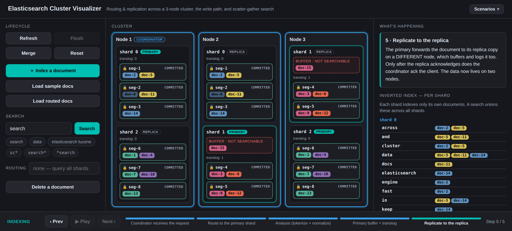

# Elasticsearch Cluster Visualizer

An interactive, single-page teaching tool that shows how **Elasticsearch / Lucene**
indexes and searches documents across a distributed cluster. Type a document,
click *Index*, and scrub step-by-step through the write path — watch it route to
a shard, replicate to a second node, land in an in-memory buffer, and (on
*Refresh*) become an immutable, searchable segment. Then *Flush*, *Merge*, and
run a *Search* that scatters across every node and is gathered into a ranked
response.

Everything is **simulated client-side** — no backend, no storage. It's built to
be screen-recorded and stepped through, not to be a configurable cluster.

**Live demo:** [elasticsearchvis.bitsculpt.top](https://elasticsearchvis.bitsculpt.top/)



## What it teaches

The whole point is to make the distinctions that usually get glossed over
*visible and steppable*:

- **Routing & replication** — `route(_id) → shard`, then the primary forwards to
  a replica on a *different* node, so every shard's data lives on two nodes.
- **The write path** — coordinator → primary → analysis (your words become
  terms) → buffer + translog (not searchable yet!) → replicate.
- **Refresh ≠ flush** — refresh turns buffered docs into immutable, *searchable*
  segments; flush makes them *durable* and clears the translog. They are
  separate steps for a reason.
- **Immutable segments & merges** — writes only ever create new segments; merges
  consolidate small ones and physically drop tombstoned (deleted) docs.
- **Scatter-gather search** — the coordinator fans the query out to one copy of
  every shard (query phase), each shard searches its own inverted index, and the
  coordinator merges, ranks, and fetches (query-then-fetch).
- **Per-shard inverted indexes** — each shard indexes only its own docs; a search
  unions posting lists across shards. That cross-shard union is the key "aha."
- **BM25, and whose statistics it used** — relevance is real BM25 (k1=1.2,
  b=0.75), and the interesting part is that a shard scores against *its own*
  document counts. Searching `search` over the sample data, doc-3 ranks first
  even though doc-2 contains the term twice as often — because doc-3 sits on a
  4-document shard, which makes the word look rarer. Switch to
  `dfs_query_then_fetch` and the coordinator collects every shard's statistics
  first: doc-2 takes the top spot and doc-3 falls to fifth. Same query, same
  documents, different numbers to measure them against.
- **Fuzzy search, and what it costs** — `serch~` finds "search"; a Levenshtein
  automaton is intersected with the same FST a wildcard walks. With
  `prefix_length` 0 the first character may be wrong, so nothing can be pruned
  and every term is read — a fuzzy is priced exactly like a leading wildcard.
  Pin two characters and the same query reads 5 terms instead of 24. And
  `store~1` matches `score`, because edit distance is spelling, not meaning.
- **Why leading wildcards are expensive** — the term dictionary is sorted, so
  `sc*` seeks straight to its range while `*search` has nothing to seek to and
  must read every term, in every segment, on every shard. You watch the probes.
- **What a routing key does** — `hash(_routing)` instead of `hash(_id)`
  co-locates a tenant on one shard, so a query carrying the same key skips the
  others entirely.

## Guided scenarios

The **Scenarios** menu (top right) runs three lessons. Each one spotlights the
real controls and waits for you to click them:

| Scenario | What you'll see |
|---|---|
| Guided intro tour | Index your first document, refresh it, load a fuller dataset, and run a scatter-gather search to completion — including both 🔍 close-ups. Runs automatically on first load, and is replayable from the menu. |
| How a typo still finds the document | `serch~` finds "search", reading every term to do it. Pin two characters with `prefix_length` and it reads a fifth as many. Then `store~1` matches `score` — the cost nobody mentions. |
| Why the same query ranks differently | The same query under `query_then_fetch` and `dfs_query_then_fetch`. The top result changes hands, and nothing about the documents did. |
| Why leading wildcards are expensive | `sc*` seeks the term dictionary in a handful of probes; `*search` reads 100% of it. The shard close-up replays both, per segment, with a live "examined" counter. |
| How a routing key works | The same query with and without `routing`: one shard serving versus all three. |

Wildcards, fuzzies and routing aren't scenario-only — a `*` in the search box
runs a wildcard query and a `~` runs a fuzzy one (with a `prefix_length` control
beside it), the routing field works on any dataset, the search-type toggle picks
`query_then_fetch` or `dfs_query_then_fetch`, and the index form takes a routing
key (watch the predicted target shard change as you type).

At the local-search step, the 🔍 on a shard leads to two deeper zooms: one on any
score, showing the BM25 arithmetic term by term and what that document would have
scored against the other collection; and one on a segment's term dictionary,
showing the `.tip` FST and which `.tim` blocks the query's automaton let it read.

## Cluster topology

A single index with **3 primary shards**, **1 replica each**, across **3 nodes**.
A replica is never on the same node as its primary:

| Shard | Primary | Replica |
|-------|---------|---------|
| 0     | node-1  | node-2  |
| 1     | node-2  | node-3  |
| 2     | node-3  | node-1  |

node-1 is the coordinator by default.

## Running it

```bash
npm install
npm run dev      # start the Vite dev server
```

Then step through: **Index → Refresh → Flush → Merge → Search**. Use the bottom
stepper (Prev / Next / Play / Pause) to scrub any operation forwards and
backwards.

Other scripts:

```bash
npm run check    # assert the pure models (no test framework — plain node)
npm run build    # production build to dist/
npm run preview  # serve the built dist/ locally
```

`npm run check` covers the arithmetic a screenshot can't verify: that the flat
dictionary scan and the FST-walking automaton agree on which terms a pattern
matched, that edit distance is really Damerau-Levenshtein, that BM25 produces
the numbers quoted above, and that the shard close-up scores identically to the
cluster-level search.

## Tech

React + Vite, with [Framer Motion](https://www.framer.com/motion/) driving the
stage animations. The core pattern is a **pure derivation of visible state from
`(cluster, op)`**, which is what lets the stepper scrub each operation in both
directions. See [`SPEC.md`](SPEC.md) for the authoritative behavior spec and the
Elasticsearch-accuracy guardrails, and [`CLAUDE.md`](CLAUDE.md) for an architecture
overview.

## Honest simplifications

This is a teaching POC, so a few things stand in for the real thing (all
documented in [`SPEC.md`](SPEC.md)):

- Routing is a deterministic string hash standing in for murmur3 `_routing`.
- BM25 is real, but over one combined text field (title + body) rather than
  per-field norms, and with an exact field length where Lucene quantizes the
  norm into a single byte — so real scores step more coarsely than these.
- Fuzzy expansions aren't blended: Elasticsearch's default rewrite blends the
  expanded terms' document frequencies and boosts by edit distance, while here
  each matched term is scored on its own.
- Primary + replica are one logical shard rendered on two nodes (no replica lag).
- Coordinator is fixed to node-1; shard/replica/merge tuning is not exposed.

## Authorship

The vast majority of this project — the simulation model, the step-by-step
operation derivation, the UI, and the animations — was developed by
**Claude Opus 4.8** (Anthropic) via Claude Code.
